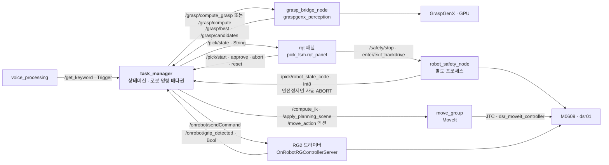
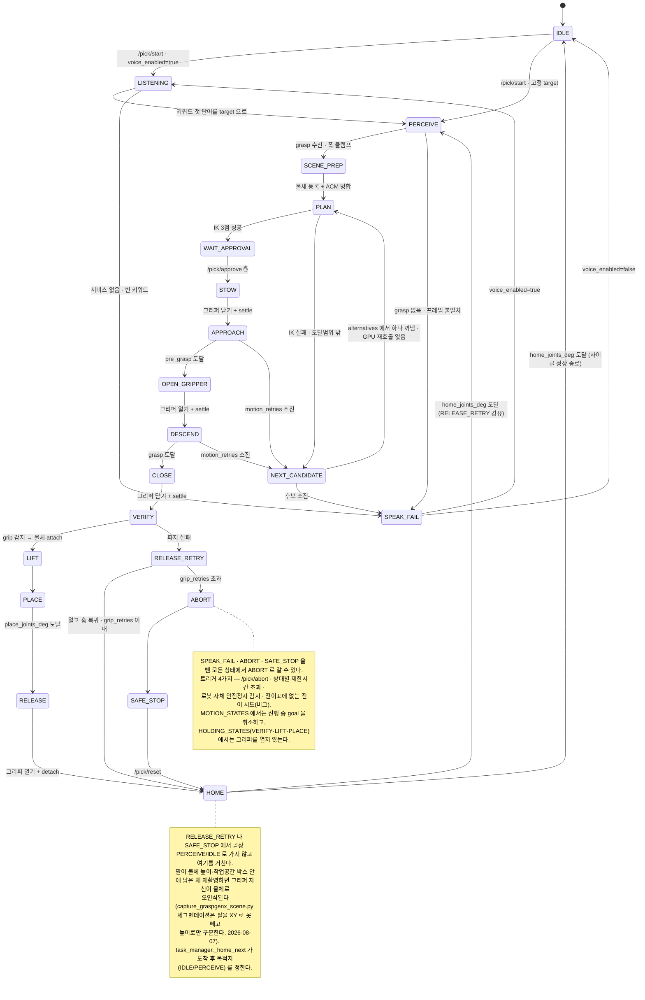

# pick_fsm — 음성 지시 pick 상태머신

설계 출처: `md/voice-pick-statemachine.md` (§1 노드 그래프 · §2 노드 간 계약 · §3 상태머신)



`task_manager` 는 **로봇 명령 경로의 배타권을 소유하는 노드**다.
이 ws 에는 `dsr_controller2`(서비스 movej/movel)와 `dsr_moveit_controller`(JTC) 두 경로가
동시에 살아 있고, 둘에 같이 명령하면 안 된다. 이 노드는 **MoveIt 경로만** 쓰며
`DSR_ROBOT2` 의 `movej`/`movel` 을 부르지 않는다.

---

## 1. 상태

`states.py` 의 `TRANSITIONS` 가 전이표의 단일 출처다. 표에 없는 전이를 시도하면 노드가
에러를 찍고 ABORT 한다 — 조용히 넘어가면 상태머신이 아니라 그냥 함수 호출이다.



위 그림에 없는 전이가 `TRANSITIONS` 에 하나 있다: `LISTENING → IDLE`. 표에는 허용돼 있지만
현재 코드에 그 경로가 없다(`_st_listening` 은 PERCEIVE 아니면 SPEAK_FAIL 로만 나간다).

`어디서든 → ABORT`는 `/pick/abort` 서비스 호출 말고 **한 가지 경로가 더 있다**: 로봇이
충돌 등으로 자체 안전정지에 들어가면(`robot_safety_node`가 감지, §8) `task_manager`가
같은 경로로 자동 ABORT 한다 — 사람이 먼저 부르지 않아도 하던 이동은 멈춘다.

문서 대비 **의도적으로 다르게 만든 곳 2가지**:

| 문서 | 구현 | 이유 |
|---|---|---|
| `PLAN --> APPROACH : 사용자 승인 ✋` (전이 라벨) | `WAIT_APPROVAL` **상태** | 승인 대기는 시간이 흐르는 구간이다. 상태가 아니면 `/pick/state` 를 봐도 "사람을 기다리는 중"인지 알 수 없다 |
| `APPROACH` 안에 EXECUTING/MONITOR/STOP_REPLAN/WAITING 서브상태 | 서브상태 없음 | move_group 의 `PlanExecution` 이 그 루프를 이미 돈다 (§4 참고). 두 겹으로 구현하면 서로 싸운다 |
| 그리퍼 열기/닫기 시점 명시 없음 | `STOW`(닫기) → `APPROACH` → `OPEN_GRIPPER`(열기) → `DESCEND` | 그리퍼가 벌어진 채로 pre-grasp 까지 장거리 이동하면 주변 물체와 부딪힐 폭이 커진다. 이동 중엔 닫아 폭을 줄이고, pre-grasp 도착 후 하강 직전에만 연다 |

## 2. 실행

기동 순서가 고정이다. 위가 안 뜨면 아래로 내려가지 않는다.

```bash
# 0) 도메인 — 새 터미널마다 필요하다
export ROS_DOMAIN_ID=93

# 1) 로봇 (실기: mode:=real / 시뮬: 기본 virtual)
ros2 launch m0609_rg2_bringup bringup.launch.py mode:=real model:=m0609

# 2) MoveIt — bringup 위에 얹을 때는 standalone:=false 다
ros2 launch m0609_rg2_moveit moveit.launch.py standalone:=false

# 3) 카메라 + 캘리브 TF (인식을 쓸 때만)
ros2 launch m0609_rg2_bringup camera.launch.py

# 4) grasp 공급원 (2026-08-07 부터 graspgenx_perception 패키지의 실행 파일이다)
ros2 run graspgenx_perception grasp_bridge_node

# 5) 상태머신 + robot_safety_node (같은 launch 로 같이 뜬다, §8)
ros2 launch pick_fsm pick_fsm.launch.py grasp_source:=legacy_trigger
# cuMotion 파이프라인으로 계획하려면 (2번에서 move_group 에 cuMotion 이 떠 있어야 한다):
ros2 launch pick_fsm pick_fsm.launch.py grasp_source:=legacy_trigger planning_pipeline:=isaac_ros_cumotion

# 6) (선택) 상태 감시 + 승인/안전 조작 UI — 언제 껐다 켜도 된다, §9
rqt --standalone pick_fsm
```

조작 — 터미널로 직접 하거나, 6번의 rqt 패널 버튼으로:

```bash
ros2 service call /pick/start   std_srvs/srv/Trigger {}   # 시작 (IDLE 에서만)
ros2 service call /pick/approve std_srvs/srv/Trigger {}   # ✋ 실행 승인
ros2 service call /pick/abort   std_srvs/srv/Trigger {}   # 중단 → SAFE_STOP
ros2 service call /pick/reset   std_srvs/srv/Trigger {}   # SAFE_STOP → HOME → IDLE
ros2 topic echo /pick/state                               # 현재 상태
ros2 service call /safety/stop            std_srvs/srv/Trigger {}   # 즉시 정지 (§8)
ros2 service call /safety/enter_backdrive std_srvs/srv/Trigger {}   # 사람이 팔을 손으로 밀 수 있게
ros2 service call /safety/exit_backdrive  std_srvs/srv/Trigger {}   # 정상 모드로 복귀
```

로봇 없이 상태 흐름만 보려면:

```bash
ros2 launch pick_fsm pick_fsm.launch.py \
  voice:=false target:=apple grasp_source:=manual gripper_backend:=virtual
# 그리고 /grasp/best 로 포즈를 직접 쏜다 (base_link 프레임, GraspGenX 원시 grasp 프레임
#   = +Z 접근축 · 원점 그리퍼 base. tool0 목표가 아니다 — 아래 "grasp 포즈는 손끝 좌표가 아니다")
```

### ⚠️ 기본값이 안전 쪽이다

`dry_run:=true` (계획만 하고 실행하지 않음) + `require_approval:=true` 가 **기본값**이다.
실기에서 움직이려면 둘 다 명시적으로 꺼야 한다.

```bash
ros2 launch pick_fsm pick_fsm.launch.py dry_run:=false     # 승인은 여전히 필요
```

### 이 랩탑의 `colcon test` 실패는 **실행과 무관하다**

`colcon test` 가 `ModuleNotFoundError: No module named '_pytest.scope'` 로 죽는 건
anyio 의 pytest 플러그인 문제이고(§7), **위 launch 경로에는 anyio 가 들어오지 않는다** —
`colcon build` PASS, `import pick_fsm.task_manager` 후 `sys.modules` 에 anyio 없음
(2026-08-07 확인). 즉 FSM 기동·상태 전이·모션 명령은 이 문제의 영향을 받지 않는다.
테스트를 돌릴 때만 플래그를 붙인다:

```bash
python3 -m pytest src/pick_fsm/test/test_pick_fsm.py -q -p no:anyio   # 23개 통과
```

## 3. 인터페이스

### 이 노드가 제공하는 것

| 이름 | 타입 | 설명 |
|---|---|---|
| `/pick/state` | `std_msgs/String` | 현재 상태 이름. 전이할 때마다 발행 |
| `/pick/start` | `std_srvs/Trigger` | IDLE 에서만 받는다 |
| `/pick/approve` | `std_srvs/Trigger` | `WAIT_APPROVAL` 에서만 받는다 |
| `/pick/abort` | `std_srvs/Trigger` | 진행 중 goal 을 취소하고 SAFE_STOP |
| `/pick/reset` | `std_srvs/Trigger` | SAFE_STOP → HOME → IDLE (팔을 홈으로 복귀시킨 뒤 대기) |
| `/pick/robot_state_code` | `std_msgs/Int8` | **`robot_safety_node`가 발행** — `task_manager`는 이 값이 안전정지류(§8)면 자동으로 abort 한다 |

### 이 노드가 쓰는 것

| 이름 | 타입 | 제공자 |
|---|---|---|
| `/get_keyword` | `std_srvs/Trigger` | `voice_processing` (기존) |
| `/grasp/compute_grasp` | `pick_fsm_msgs/ComputeGrasp` | **아직 없음** — 정본 계약 |
| `/grasp/compute` | `std_srvs/Trigger` | `graspgenx_perception` 의 `grasp_bridge_node` (현행) |
| `/grasp/best`, `/grasp/candidates` | `PoseStamped`, `PoseArray` | 같은 브리지 |
| `/compute_ik` | `moveit_msgs/GetPositionIK` | `move_group` |
| `/move_action` | `moveit_msgs/MoveGroup` (액션) | `move_group` |
| `/apply_planning_scene` | `moveit_msgs/ApplyPlanningScene` | `move_group` |
| `/clear_octomap` | `std_srvs/Empty` | `move_group` |
| `/onrobot/sendCommand` | `onrobot_rg_msgs/SetCommand` | RG2 드라이버 |
| `/onrobot/grip_detected` | `std_msgs/Bool` | RG2 드라이버 (실기 전용) |

### `grasp_source` 3가지

| 값 | 동작 | 언제 |
|---|---|---|
| `compute_grasp` | `ComputeGrasp` 서비스 호출 → 포즈+폭+대안 | **정본.** 브리지를 패키지로 올린 뒤 |
| `legacy_trigger` | `/grasp/compute`(Trigger) 호출 → `/grasp/best` 를 읽음. **폭 정보가 없어 `default_width_m` 로 잡는다** | 지금 실제로 도는 경로 |
| `manual` | 서비스 호출 없이 `/grasp/best` 만 구독 | 로봇/GPU 없이 상태 흐름 확인 |

`legacy_trigger` 는 서비스 호출 **이후에 들어온** `/grasp/best` 만 쓴다(시퀀스 비교).
직전 요청의 포즈를 재활용하면 아무 로그도 없이 엉뚱한 물체를 집는다.

## 4. 설계 판단 — 알고 켜야 하는 것들

### grasp 포즈는 손끝 좌표가 아니다

`ComputeGrasp.grasp_pose` 는 **GraspGenX 원시 grasp 프레임**이다 — 손끝(TCP)도 아니고
`ee_link` 목표 자세도 아니다. 규약은 `+Z=접근축 · +X=손가락 닫힘 · 원점=그리퍼 base`.

🔴 **`tool0` 목표가 아니다** (2026-08-07 정정). `tool0` 의 접근축은 +Z 가 아니라 **+X** 다
(`onrobot_rg2.xacro:40` `rpy="1.5708 0 1.5708"`). 이 포즈를 `ik_link=tool0` 로 넘기면
그리퍼가 90° 누운 채 계획된다 — 실기에서 전 후보 `NO_IK_SOLUTION(-31)` 로 나타났다.
FSM 이 `_accept_grasp()` 에서 `geometry.to_gripper_base()`(로컬 요 +90°)를 걸어
**`rg2_base_link` 목표 자세**로 바꾼 뒤 IK 에 넘긴다. 생산자는 변환하지 말고 원시 프레임을 준다.
근거·회전행렬은 `md/context/constraints.md` "정본: grasp 프레임 = `rg2_base_link`".

손끝은 거기서 +Z 로 `rg2.fingertip_from_rg2_base_m(width_m)`(닫힘 0.218 m) 만큼 떨어져 있고,
로그·CollisionObject 배치에만 쓴다. ⚠️ 플랜지면 기준인 `fingertip_length_m()`(0.240 m)과
혼동하지 말 것 — 차이는 브라켓 22 mm 다.

> 문서 §2 의 필드 이름 `grasp_tcp` 를 **`grasp_pose` 로 바꿨다.** 이름이 "TCP"인데 값은
> 그리퍼 base 라서, 그대로 두면 18 cm 오차를 부르는 이름이다.

### SCENE_PREP — octomap 은 자동으로 안 비켜준다

대상 물체를 `CollisionObject`(구) 로 등록하고 ACM 에서 **그리퍼 링크 ↔ 대상** 충돌을 허용한다.
허용하지 않으면 grasp pose 에서 손가락이 물체와 겹쳐 **IK 가 collision 으로 실패**한다
(잡으러 가는 게 목적인데 닿는 걸 금지하는 셈).

**하지만 이걸로 octomap 복셀은 사라지지 않는다.** D435i 가 본 물체는 여전히 장애물이다.
계획이 실패하면 아래 둘 중 하나로 올라가야 하고, **둘 다 공짜가 아니다**:

| 파라미터 | 하는 일 | 포기하는 것 |
|---|---|---|
| `clear_octomap_before_descend: true` | 하강 직전 octomap 전체 삭제 | 사람 팔 포함 **모든** 미모델링 장애물이 재관측 전까지 안 보인다 |
| `allow_gripper_octomap_collision: true` | 그리퍼 링크 ↔ `<octomap>` 충돌 허용 | 그 링크들의 octomap 충돌검사가 **통째로** 꺼진다. 물체 복셀만 골라 끄는 게 아니다 |

둘 다 기본 `false` 다. 기본 상태의 실패는 "계획 실패 = 안 움직임"이라 안전한 실패다.

### STOP_REPLAN 은 move_group 에 맡긴다

`planning_options.replan / replan_attempts / replan_delay` 를 켠다. move_group 의
`PlanExecution` 이 실행 중 planning scene 갱신을 감시하다가 궤적이 무효가 되면 멈추고
다시 계획한다. 즉 재개 조건이 "장애물이 사라지면"이 아니라 **"새 경로가 나오면"** 이다 —
사람이 비켜주지 않아도 돌아간다. 문서 §3 ②가 요구한 그대로다.
FSM 은 이 루프를 다시 구현하지 않고, 그것마저 실패했을 때의 **바깥 재시도**(`motion_retries`)만 센다.

### IK 는 3점을 시드로 연결한다

`pre_grasp → grasp → lift` 를 순서대로 풀되 **직전 해를 시드로 넘긴다.** 안 넘기면 각 점이
서로 다른 IK 분기에 앉을 수 있고, 그러면 10 cm 하강이 팔 전체를 뒤집는 궤적이 된다.
그리고 계획은 포즈 목표가 아니라 **관절 목표**로 준다 — 포즈로 주면 move_group 이 IK 를
다시 풀어서 우리가 도달 가능하다고 판정한 그 해로 안 갈 수 있다.

### VERIFY 는 grip 비트로 한다 (문서와 다름)

> 문서 §3 ④는 "그리퍼 폭 피드백이 힘 센서 없이 판정 가능한 유일한 신호"라고 적었다.
> **이건 사실이 아니다.** 드라이버가 `/onrobot/grip_detected`(`std_msgs/Bool`)를 발행한다 —
> gSTA 상태워드(register 268)의 bit1, 즉 "내부/외부 그립 감지" 비트다
> (`OnRobotRGControllerServer.py:226-228`). 폭 피드백보다 직접적이라 이쪽을 쓴다.

단 **가상 그리퍼 노드는 이 토픽을 발행하지 않는다.** 못 받았을 때는 판정을 `None`(모름)으로
두고 기본값에서는 통과시킨다(`verify_required: false`). 실패로 읽으면 시뮬이 매번 멈춘다.

### 🔴 그리퍼 힘이 기본 40 N (RG2 최대)이다

드라이버는 기동 시 `rgfr = max_force = 400` (= 40.0 N) 으로 시작하고
(`OnRobotRGControllerServer.py:57`), `/onrobot/sendCommand` 로 **힘을 직접 지정할 방법이 없다.**
`genCommand` 가 받는 건 `'o'/'c'/'i'/'d'/숫자` 뿐이고, 숫자는 폭(rgwd)이지 힘이 아니다.

→ `force_down_steps` 는 `'d'`(−25 = −2.5 N)를 그 횟수만큼 보내는 우회로다. 기본 0(= 40 N 유지).
**사과 같은 것을 집기 전에 이 값을 올려야 한다.** 이건 우회로지 해결이 아니다 —
정본 해결은 드라이버에 힘 지정 인터페이스를 추가하는 것이다.

### 🔴 숫자 명령의 단위가 실기와 가상에서 다르다

| 노드 | `command="480"` 의 의미 |
|---|---|
| `OnRobotRGControllerServer.py:289` (실기) | `rgwd` = **48.0 mm** (1/10 mm 단위) |
| `gripper_virtual_node.py:52` (가상) | **관절각 0.785 rad** (URDF 한계로 클램프) |

그래서 `gripper_backend` 파라미터가 있다. `virtual` 이면 폭 명령 대신 `'c'`/`'o'` 만 보낸다
(폭↔각도 변환을 여기서 새로 짜지 않는다 — 드라이버에 `widthToJointValue()` 가 이미 있고,
상수를 베껴오면 드라이버가 바뀔 때 조용히 갈라진다).

### ABORT 시 그리퍼를 열지 않는다

`VERIFY`/`LIFT`/`PLACE` 에서 ABORT 가 나면 물체를 물고 있을 수 있다.
떨어뜨리는 게 멈춰 있는 것보다 위험하므로 **그리퍼는 그대로 두고** 정지한다.

## 5. 파라미터

정본은 `config/pick_fsm.yaml` 이다. 여기 값을 베껴 적지 않는다 — 아래는 손잡이 목록만이다.

| 그룹 | 파라미터 | 비고 |
|---|---|---|
| 안전 | `dry_run`, `require_approval`, `approval_timeout_sec` | 기본값이 안전 쪽 |
| MoveIt | `planning_group`, `ee_link`, `base_frame`, `joint_names`, `vel_scale`, `acc_scale`, `planning_time`, `planning_attempts`, `joint_tolerance`, `ik_timeout_sec`, `ik_avoid_collisions`, `planning_pipeline`, `planner_id`, `replan*`, `motion_retries` | `base_frame` 은 `world` 가 아니라 `base_link`. `planning_pipeline`: `ompl`(기본) \| `isaac_ros_cumotion` — IK 는 파이프라인을 안 타므로 영향 없음, `_move()`(관절목표 계획)에만 적용됨. 그 파이프라인이 `move_group`에 떠 있어야 한다 |
| 자세 | `approach_offset_m`, `lift_offset_m`, `max_reach_m`, `home_joints_deg`, `place_joints_deg` | 관절값은 **도(deg)**. 내부에서 rad 로 변환. 손끝 오프셋은 파라미터가 아니라 `rg2.fingertip_length_m(width_m)` 계산값이다(2026-08-07) |
| 씬 | `object_id`, `object_radius_m`, `clear_octomap_before_descend`, `allow_gripper_octomap_collision`, `gripper_links` | 뒤 둘은 §4 읽고 켤 것 |
| 그리퍼 | `gripper_backend`, `grip_clearance_m`, `max_grip_width_m`, `force_down_steps`, `gripper_settle_sec`, `verify_required`, `grip_retries` | |
| 인식 | `grasp_source`, `grasp_service`, `min_confidence`, `default_width_m`, `max_alternatives` | |
| 음성 | `voice_enabled`, `keyword_service`, `target` | |

**UNVERIFIED 표시가 붙은 값들** (`approach_offset_m`, `lift_offset_m`, `object_radius_m`,
`grip_clearance_m`, `gripper_settle_sec`, `default_width_m`)은 도면값이 아니라 임의로 정한
출발점이다. 실기에서 갈아야 한다.

## 6. 검증 상태 — 무엇을 어떻게 확인했나

**검증 환경 (2026-08-06)**: `ROS_DOMAIN_ID=77` 로 실기 세션(도메인 93)과 **완전히 분리**하고,
`moveit.launch.py standalone:=true rviz:=false octomap:=false` + `gripper_virtual_node.py`(목업)만
띄웠다. 로봇·카메라·실기 그리퍼는 이 도메인에 없었고 `dry_run:=true`(plan_only)였다.

| 항목 | 상태 | 방법 |
|---|---|---|
| `colcon build --packages-select pick_fsm_msgs pick_fsm` | ✅ 통과 | §7 |
| 단위테스트 23개 | ✅ 통과 | 폭 단위 변환 · 접근축 오프셋 · 전이표 · ACM 병합 · **§1 mermaid 다이어그램 ↔ `TRANSITIONS` 대조**(2026-08-07 추가). 실행: `python3 -m pytest src/pick_fsm/test/test_pick_fsm.py -q -p no:anyio` |
| `colcon test --packages-select pick_fsm` | ❌ **이 랩탑에서 실행 불가** | 이 패키지 문제가 아니다 — 아래 "colcon test 가 안 도는 이유" 참고. `colcon` 에는 `-p no:anyio` 를 넣을 자리가 없다. 2026-08-07 확인 |
| 사용하는 MoveIt 메시지 필드명·상수 | ✅ 확인 | `moveit_msgs` 를 import 해 `get_fields_and_field_types()` 로 대조 |
| `<octomap>` ACM 이름 | ✅ 확인 | `libmoveit_planning_scene.so` 문자열 |
| RG2 명령 형식 (`'o'/'c'/숫자`, 1/10 mm) | ✅ 확인 | `OnRobotRGControllerServer.py:258-303`, `OnRobotRGOutput.msg` |
| `/onrobot/grip_detected` 존재 | ✅ 확인 | 같은 파일 `:171, :226-228` |
| 노드 기동 (런치·파라미터·타입변환) | ✅ 확인 | `ros2 launch pick_fsm pick_fsm.launch.py` |
| `/get_planning_scene` → `/apply_planning_scene` (SCENE_PREP) | ✅ 확인 | `대상 등록 + ACM 15개 보존` |
| `/compute_ik` 3점 연속(시드 체이닝) | ✅ 확인 | `[PLAN] -> [WAIT_APPROVAL] IK 3점 성공` |
| MoveGroup 액션 **계획**(plan_only) 4구간 | ✅ 확인 | pre_grasp/grasp/lift/place/home 전부 0.02s 내 성공 |
| 전체 happy path (IDLE→…→HOME→IDLE) | ✅ 확인 | 목업 그리퍼 + plan_only 로 완주 |
| 승인 게이트 · 제한시간 → ABORT → SAFE_STOP | ✅ 확인 | CLOSE 20s 초과 시 정상 ABORT |
| **`planning_options.replan` 이 실제로 재계획하는지** | ⚠️ **추론** | MoveIt 소스 구조상 그렇지만 관측한 적 없음. 장애물을 손으로 넣어봐야 확정된다 |
| **octomap 이 있을 때 grasp pose 계획이 되는지** | ❌ **미검증** | 위 검증은 `octomap:=false` 였다. §4 SCENE_PREP 의 진짜 시험은 여기서 시작한다 |
| **`gripper_links` 이름이 URDF 와 일치하는지** | ❌ **미검증** | 틀려도 ACM 병합은 성공한다 — 조용히 아무 데도 안 걸린다 |
| **실기 실행(dry_run:=false)** | ❌ **미검증** | `tool0 → RG2 손끝` 실측(줄자)이 선행 블로커다 (`md/state.md` 0번) |

### 🔴 검증 중에 잡은 실제 버그 (2026-08-06)

**`PlanningScene.allowed_collision_matrix` 는 `is_diff=true` 여도 병합이 아니라 전체 교체다.**

처음 구현은 그리퍼 링크 7개짜리 ACM 만 diff 로 보냈다. 그랬더니 SRDF 의
`disable_collisions` 34개가 통째로 사라져 `rg2_base_link ↔ rg2_left_outer_knuckle` 같은
**인접 링크가 자기충돌**로 잡혔고, `avoid_collisions=true` IK 가 **모든 포즈에서**
`NO_IK_SOLUTION` 을 냈다. 증상이 "포즈가 도달 불가"로 보여서 오진하기 딱 좋다.

가른 방법: `avoid_collisions=false` 로는 같은 포즈가 풀렸다(= 도달성 문제가 아님)
→ `/check_state_validity` 의 `contacts` 가 **전부 인접 링크쌍**이었다 → ACM 을 의심.
`/get_planning_scene` 으로 읽어보니 `entry_names` 가 내가 보낸 7개뿐이었다.

수정: `merge_acm()` 이 현재 ACM 을 읽어 거기에 얹는다. 회귀 테스트 5개로 고정했다.
고친 뒤 같은 포즈에서 `ACM 15개 보존` + `IK 3점 성공`.

### 알려진 자잘한 것

- ABORT 로 끝나면 `pick_target` CollisionObject 와 ACM 항목이 씬에 남는다. 다음 실행이
  같은 id 로 덮어쓰므로 실해는 없지만, RViz 에 유령 구가 보이면 이것이다.
  치우려면 `/pick/reset` 후 RViz Scene Objects 에서 지우거나 move_group 을 재기동한다.
  (물고 있는 상태에서 ABORT 했을 때 detach 하면 안 되므로 일부러 자동 정리를 안 한다.)

### ⛔ 실기 전 블로커

1. **`tool0` 플랜지면 → RG2 손끝 거리 — 2026-08-07 실측·배선 완료, 실기 확인만 남았다.**
   닫힘 240 mm = 브라켓+퀵커넥터 22 mm + 그리퍼 자체 218 mm (`md/context/constraints.md` "GraspGenX 관련").
   폭에 따라 변하는 성분(개구 70/100 mm 에서 17/41 mm 후퇴)은 `rg2.fingertip_length_m()`으로,
   고정 성분(22 mm 브라켓)은 `onrobot_rg2.xacro`(`has_bracket=true`, `xyz` 0.004→0.022)로
   반영했다. `colcon build` PASS. **미검증**: RViz 육안 확인, self-collision 경계 재검토 —
   로봇 세션에서 확인할 것.
2. **`gripper_links` 이름 대조.** 기본값은 URDF 매크로에서 유추한 것이다. 틀리면 ACM 항목이
   조용히 아무 데도 안 걸린다. 확인: `ros2 param get /move_group robot_description` 에서 `rg2_` 링크 목록.
3. **`force_down_steps`** — 40 N 으로 사과를 물면 으깬다 (§4).

## 7. 빌드·테스트

```bash
cd ~/cobot2_ws
source /opt/ros/humble/setup.bash
colcon build --symlink-install --packages-select pick_fsm_msgs pick_fsm
colcon test --packages-select pick_fsm && colcon test-result --verbose

# ⚠️ 위 colcon test 는 이 랩탑에서 안 돈다 (아래 참고). 그동안은 pytest 를 직접 부른다:
python3 -m pytest src/pick_fsm/test/test_pick_fsm.py -q -p no:anyio
```

### `colcon test` 가 안 도는 이유 (2026-08-07 진단)

`pytest` 는 시작할 때 `pytest11` 엔트리포인트를 **전부 자동 로드**한다. 그중 `anyio` 의
플러그인이 pytest ≥7 의 `_pytest.scope` 를 import 하는데, 이 랩탑의 pytest 는 apt 6.2.5 뿐이라
(`~/.local` 에 pip pytest 없음 — `sys.path` 로 확인) **테스트를 수집하기도 전에** 죽는다:

```
ModuleNotFoundError: No module named '_pytest.scope'
  .../anyio/pytest_plugin.py:15
```

anyio 가 이 머신에 **두 벌** 깔려 있다. 둘 다 `pytest11` 을 등록하므로 둘 다 꺼야 한다:

| 위치 | 버전 | 범위 | 상태 |
|---|---|---|---|
| `~/.local/lib/python3.10/site-packages/anyio-4.13.0.dist-info` | 4.13.0 | `kimkh` 계정만 | `entry_points.txt` → `.disabled` 로 이름 변경함 (2026-08-07) |
| `/usr/local/lib/python3.10/dist-packages/anyio-4.14.1.dist-info` | 4.14.1 | **랩탑 전체 계정** (`sudo pip` 흔적) | ⛔ 손대지 않음 — 공유 자원이라 승인 필요 |

**anyio 패키지 자체는 지우면 안 된다.** `httpx`·`httpcore`·`openai`·`jupyter_server`·
`jupyter_client`·`starlette`·`watchfiles`·`langsmith` 8개가 의존한다 — 지우면 `nlm`(notebooklm),
jupyter, uvicorn 이 같이 죽는다. 꺼야 할 것은 **`entry_points.txt` 의 `[pytest11]` 등록 한 줄**뿐이고,
그 플러그인은 pytest 6.2.5 에서 어차피 못 쓴다.

**2026-08-07 결정: `/usr/local` 은 건드리지 않고 `-p no:anyio` 로 간다.** 이 충돌은 테스트에만
영향을 주고 FSM 실행에는 영향이 없어서(§2), 공유 랩탑의 전역 자원을 손댈 이유가 없다.
나중에 `colcon test` 를 꼭 살려야 하면 아래 한 줄이면 되지만, **모든 계정에 영향을 준다**:

```bash
sudo mv /usr/local/lib/python3.10/dist-packages/anyio-4.14.1.dist-info/entry_points.txt{,.disabled}
```

같은 이유로 깨질 수 있는 다른 플러그인 2개(`langsmith`, `dash`)는 확인해보니 pytest 6.2.5 에서
정상 import 된다 — anyio 하나만 문제다.

`pick_fsm_msgs` 를 별도 패키지로 뺀 이유: `ament_python` 패키지는 인터페이스를 생성하지
못하고, 한 `ament_cmake` 패키지에서 `rosidl_generate_interfaces` 와
`ament_python_install_package` 를 같이 쓰면 생성된 `<pkg>/__init__.py` 와 우리 모듈이
같은 설치 경로에서 충돌한다.

## 8. `robot_safety_node` — 안전정지·backdrive

```bash
ros2 run pick_fsm robot_safety_node          # pick_fsm.launch.py 를 쓰면 자동으로 같이 뜬다
```

`task_manager` 와 **별도 프로세스**다. FSM이 에러 루프에 갇히거나 죽어도 안전 조작은 계속
먹어야 한다는 원칙 — 안전 기능을 복잡한 상위 로직의 건강 상태에 기대게 하지 않는다.

| 이름 | 타입 | 설명 |
|---|---|---|
| `/pick/robot_state_code` | `std_msgs/Int8` (pub) | `GetRobotState.srv` 원본 정수, 2 Hz |
| `/pick/robot_state_text` | `std_msgs/String` (pub) | 사람이 읽는 이름 (`SAFE_STOP` 등) |
| `/safety/stop` | `std_srvs/Trigger` | `MoveStop(DR_HOLD)` — 즉시 정지 |
| `/safety/enter_backdrive` | `std_srvs/Trigger` | `SetSafetyMode(BACKDRIVE)` — 사람이 손으로 팔을 밀 수 있게 |
| `/safety/exit_backdrive` | `std_srvs/Trigger` | `SetSafetyMode(AUTONOMOUS)` + 필요하면 `SetRobotControl(RESET_SAFET_STOP/OFF)` |

세 서비스 다 **fire-and-forget**이다 — `/pick/start`와 같은 계약으로, 응답은 "요청 보냈다"
뿐이고 실제 결과는 로그와 `/pick/robot_state_text`로 나중에 드러난다. 서비스 콜백 안에서
`spin_until_future_complete`를 쓰면 재진입으로 엉킨다는 게 이 워크스페이스에서 이미 겪은
함정이라(`task_manager.py`의 `_service()` 주석) 아예 블로킹을 피했다.

### ⚠️ backdrive는 두 가지가 있고, 하나는 위험하다

`SetSafetyMode(safety_mode=BACKDRIVE)` 만 쓴다. **`SetRobotControl(robot_control=
CONTROL_RECOVERY_BACKDRIVE)`(값 6)는 절대 안 쓴다** — 이름이 비슷해서 헷갈리기 쉬운데,
그건 `STATE_SAFE_OFF2` 전용 H/W 복구 경로라 쓰면 **컨트롤러 전원을 재부팅해야
STATE_STANDBY로 돌아온다**(`dsr_msgs2/srv/system/SetRobotControl.srv:15` 주석 원문). `robot_safety_node.py`
는 이 값을 아예 안 쓰지만, 나중에 이 파일을 손대는 사람을 위해 여기 적어둔다.

### ⚠️ 실기 미검증

이 워크스페이스에서 `/safety/enter_backdrive`·`/safety/exit_backdrive`를 실제 로봇으로
눌러본 적이 없다(2026-08-07 작성). `dsr_controller2.cpp`의 `OnMonitoringStateCB`가
`STATE_SAFE_STOP`에서는 스스로 복귀를 시도한다는 것도 **소스를 읽고 판단한 것**이지
실기로 관측한 게 아니다. 처음 쓸 때는:
- 비상정지 버튼을 손 닿는 곳에 둘 것
- 저속·저위험 자세(팔이 사람이나 장애물에서 먼 자세)에서 먼저 `enter_backdrive` 눌러
  실제로 손으로 밀리는지, `exit_backdrive`가 정상 모드로 정말 돌아오는지 확인할 것
- 안 되면 티치펜던트로 개입할 수 있는 상태를 유지할 것 (이 서비스들이 펜던트를
  대체하는 게 아니라, 대체 안 되는 순간을 위해 펜던트가 항상 그 자리에 있어야 한다)

## 9. 상태/제어 UI — rqt 패널

```bash
source /opt/ros/humble/setup.bash && source install/setup.bash
rqt --standalone pick_fsm
```

`pick_fsm.launch.py`와 **별개로** 뜬다 — UI는 껐다 켰다 해도 자동중단(§8)은 항상 동작해야
하고, 반대로 UI만 열어서 상태를 구경하고 싶을 때 로봇 쪽 launch를 다시 켤 필요가 없어야
하기 때문이다. `rqt`는 여러 패널을 한 창에 도킹할 수 있다 — 로그를 같이 보고 싶으면
`rqt_console`을 같은 창에 추가하면 된다(따로 로그 뷰어를 만들지 않았다).

패널 구성:
- FSM 상태(`/pick/state`) · 로봇 상태(`/pick/robot_state_code`, 안전정지류면 빨간 글씨) 표시
- 작업: 시작 / 승인 / 리셋
- 정지: 중단(ABORT, `/pick/abort`) / 즉시정지(`/safety/stop`) — 빨간 버튼
- 안전모드: 진입(backdrive) / 해제 — 누르면 확인창이 뜬다(§8 "실기 미검증" 참고)

버튼은 전부 `call_async()`로 쏘고 바로 리턴한다. Qt 위젯은 GUI 스레드에서만 만지고,
ROS 콜백은 값만 변수에 써두면 200ms 타이머가 라벨에 반영한다 — ROS 콜백 스레드에서
Qt 위젯을 직접 건드리면 크래시할 수 있어서다.

### 검증

`rclpy` + `python_qt_binding`으로 오프스크린(`QT_QPA_PLATFORM=offscreen`) 위젯 생성·구독
콜백·버튼 클릭(서비스 없을 때 "서비스 없음" 메시지로 안전하게 처리)까지는 직접 실행해
확인했다(2026-08-07). **rqt_gui 플러그인 탐색 메커니즘으로 실제 `rqt` 프로세스 안에서
로드되는 것 자체는 이 세션에서 디스플레이가 없어 확인 못 했다** — 처음 띄울 때
`rqt --standalone pick_fsm`가 목록에 뜨는지부터 볼 것.
